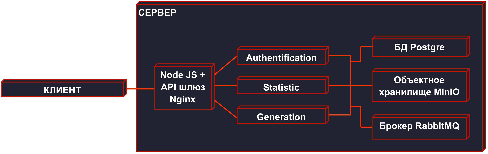

# Чемпионат Центрального Федерального Округа по спортивному программированию (Программирование продуктовое) 

## Навигация
- [Armada Random Sequence Generator](#-armada-random-armada-sequence-generator)
- [Проблематика](#-проблематика)
- [Готовность задания](#-готовность-задания)
- [Архитектура проекта](#️-архитектура-проекта)
- [Развитие продукта](#-развитие-продукта)
- [Установка и запуск](#️-установка-и-запуск)
- [Команда](#-команда-armada)

  
## Armada Random Sequence Generator

Мы **Armada** - команда разработчиков, которая создала полнофункциональный веб-сайт для генерации криптографически стойких случайных последовательностей и чисел. Наш продукт сочетает микросервисную архитектуру на базе FastAPI, PostgreSQL, RabbitMQ и MinIO, обеспечивая высокую надежность, безопасность и масштабируемость. Веб-сайт идеально подходит для лотерей, игр и криптографических приложений, где требуется истинная непредсказуемость и воспроизводимость.

Мы стремимся объяснить и продемонстрировать пользователю, как современные технологии могут решать проблемы случайности в цифровом мире. 

Наш сайт доступен по [адресу](https://codedepartament.ru/) (login:admin, password:adminadmin).

Без авторизации пользователю доступна демонстрация работы ГСЧ, а также текстовое описание работы алгоритма.

После авторизации или регистрации пользователь получает доступ ко всему функционалу платформы.

- **Уточнение 1:** для верификации цифрового слепка тиражного розыгрыша пользователь должен ввести энтропию, которая будет ему выведена,
и ввести ее в поле верификации. Сервер пришлет полученную выигрышную комбинацию, если комбинации совпадают, то верификация пройдена!

- **Уточнение 2:** сравнение нашего алгоритма генерации со сторонними производится в целях продемонстрировать способность нашего подхода конкурировать с остальными.

- **Уточнение 3:** данные в дашборде могут не впечатлить жюри, однако выбросы и тесты связаны с генерациями короктих последовательностей или последовательностей на случайной энтропии,
которые проводились для тестирования алгоритма.

- **Уточнение 4:** новая энтропия получается каждую минуту, поэтому при генерации тиражных комбинаций с лагом менее чем в минуту числа могут повторяться. **Пожалуйста, соблюдайте интервал в одну минуту
при генерации тиражных розыгрышей!**

[Презентация и скринкаст](https://drive.google.com/drive/folders/1McxD10nRtYiYHCf8FNPVJXlvU7mHCiHU?usp=drive_link)

## 📋 Проблематика

В современном мире генерация случайных чисел сталкивается с серьезными вызовами:

- **Низкая прозрачность** работы большинства генераторов, ведущая к слабому пониманию принципов их работы;
- Технологическая сложность алгоритмов генерации, повышающая **сложность восприятия** неподготовленными пользователями;
- **Высокая предсказуемость** или низкая стойкость у понятных пользователю генераторов;
- **“Заезженность”** и широкая известность большинства методов, что делает их менее привлекательными в коммерческом плане.

Наш веб-сайт решает эти проблемы через интеграцию внешних источников энтропии, постобработку и [регистра сдвига с линейной обратной связью](backend/generator_service/services/lfsr).

## ⚡ Готовность задания:

- ✅ **Проверка качества** ГСЧ на  **1 000 000** бинарных значений (0 и 1)
- ✅ **Выполнение сценариев** - 3/3
- ✅ **Выполнение технических требований**

  
### Дополнительные сценарии:
1. Анализ работы ГСЧ с использованием **интерактивной деманстрационной панель (Дашборд)**
2. Сравнение с **другими источниками случайных последовательностей** 
3. Верификация **цифровых слепков** тиражных розыгрышей в целях проверки корректности генерации

## 🛠️ Архитектура проекта

Веб-сайт построен на трех ключевых микросервисах, каждый из которых отвечает за свою область:

### 🔐 Auth Service
Микросервис для аутентификации пользователей и управления JWT-токенами. Обеспечивает безопасный доступ к генерации последовательностей.
- **Функции**: Регистрация, логин, верификация токенов через RabbitMQ.
- **Подробнее**: ([Auth_Service_readme.md](backend/authentication_service/README.md))

### 🎲 Generation Service
Сервис генерации случайных последовательностей на основе LFSR с примитивными полиномами. Использует данные солнечных вспышек от NOAA для энтропии.
- **Функции**: Генерация бинарных строк, победителей лотерей, верификация, хранение в БД и MinIO.
- **Подробнее**: ([generation_service_readme.md](backend/generator_service/README.md))

### 📊 Statistics Service
Микросервис для статистического анализа последовательностей с тестами NIST. Проверяет качество генерации.
- **Функции**: Анализ частоты, серий, автокорреляции и др., кэширование результатов, дашборд.
- **Подробнее**: ([statistics_service_readme.md](backend/README.md))

Архитектура обеспечивает:
- **Криптографическую стойкость**: LFSR с периодом до 2^128 - 1.
- **Внешнюю энтропию**: Данные от NOAA для непредсказуемости.
- **Постобработку**: Метод фон Неймана для коррекции.
- **Масштабируемость**: Микросервисы с асинхронной связью.

## 📈 Развитие продукта

Мы активно развиваем проект, фокусируясь на расширении функциональности:

- **Имплементация** асинхронной очереди задач **Celery** для непрерывного фонового сбора энтропии;
- Частичный **переход на** технологии **WebSocket** для поддержания соединения и обмена информацией о состоянии генерации или статистической проверки;
- **Совершенствование** процесса **сбора энтропии** для получения более точных значений микрофлуктуаций;
- **Применение генеративных ИИ-моделей** для объяснения провалов в статистических тестах;
- **Практические применения**: лотереи и игры, научные симуляции.

## 🏗️ Установка и запуск

### Инструкция по установке ([local_deploy_README](local_deploy/README.md))

## 👥 Команда Armada

Спасибо за внимание! Мы надеемся, что наш проект вдохновит вас на новые идеи в области генерации случайности. 🚀
