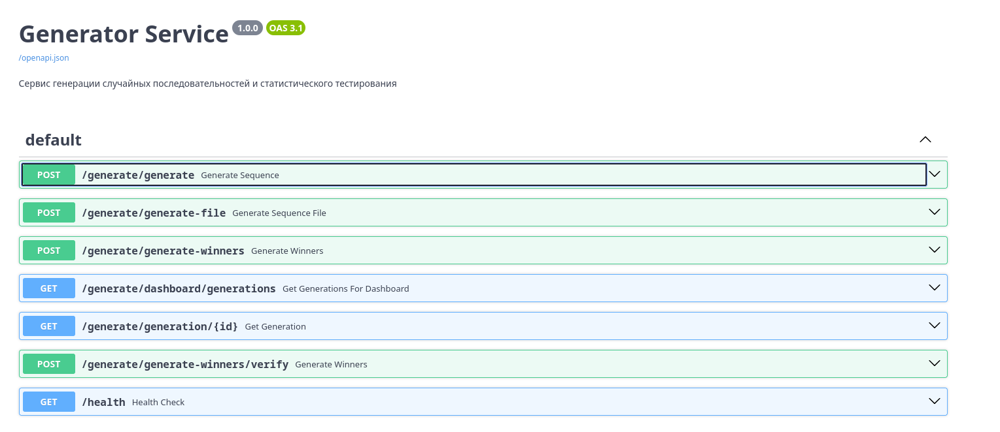

# Сервис на базе FastAPI для генерации криптографически стойких случайных последовательностей и чисел с использованием Linear Feedback Shift Register (LFSR). Идеально подходит для лотерей, симуляций и статистического тестирования, где требуется высокая энтропия и воспроизводимость.

## Описание

Этот сервис генерирует псевдослучайные последовательности на основе LFSR с примитивными полиномами, обеспечивая максимальный период (до 2^128 - 1). Сид (начальное состояние) формируется из реальных данных солнечных вспышек (от NOAA), что добавляет непредсказуемость. Сервис интегрируется с PostgreSQL для хранения результатов, MinIO для файлов и RabbitMQ для сообщений.

## Функциональность

- **Генерация последовательностей**: Создание бинарных строк заданной длины с коррекцией по методу фон Неймана.
- **Генерация победителей**: Выбор уникальных чисел в заданном диапазоне для лотерей или розыгрышей.
- **Верификация**: Повторная генерация на основе фиксированного сида для проверки.
- **Хранение**: Сохранение в БД и файлы в MinIO (JSON, TXT).
- **Дашборд**: Получение списка генераций для фронтенда.
- **Файлы**: Экспорт результатов в текстовые файлы.
- **Безопасность**: Использование внешних данных для сида, коррекция ошибок.

## API Документация

## Эндпоинты

### POST /generate/generate
Генерирует последовательность и сохраняет в БД.
- **Вход**: `{"length": int}`
- **Выход**: `{"id": str, "initial_fill": str, "sequence": str}`

### POST /generate/generate-file
Генерирует последовательность и возвращает файл .txt.
- **Вход**: `{"length": int}`
- **Выход**: Файл с данными.

### POST /generate/generate-winners
Генерирует победителей и сохраняет.
- **Вход**: `{"max_number": int, "count_of_winning_numbers": int}`
- **Выход**: `{"id": str, "winning_tickets": str, "sequence": str, "initial_fill": str, "seed": str}`

### POST /generate/generate-winners/verify
Верифицирует генерацию с фиксированным сидом.
- **Вход**: `{"seed": str, "max_number": int, "count_of_winning_numbers": int}`
- **Выход**: `{"winning_tickets": str}`

### GET /generate/dashboard/generations
Получает список генераций для дашборда.
- **Выход**: Список `[{"created_at": str, "seed": float}]`

### GET /generate/generation/{id}
Получает генерацию по ID.
- **Выход**: `{"id": str, "initial_fill": str, "sequence": str}`

### GET /generate/generate-side/{length}
Генерирует две бинарные последовательности (python_random и random_org) заданной длины.
Вход: length (в пути)

- **Выход**: `{"python_random": str, "random_org": str}`

Все эндпоинты возвращают JSON или файлы. Ошибки: 400 (некорректные параметры), 404 (не найдено), 500 (внутренняя ошибка).

## Структура проекта

- `api/`: Эндпоинты FastAPI.
- `models/`: SQLAlchemy модели (Generation).
- `schemas/`: Pydantic схемы.
- `services/`: Логика (GenerationService, FileService, LFSR).
- `utils/`: Утилиты для сида и комбинаций.

## Безопасность

LFSR использует примитивные полиномы для криптостойкости. Сид из внешнего источника добавляет энтропию.
